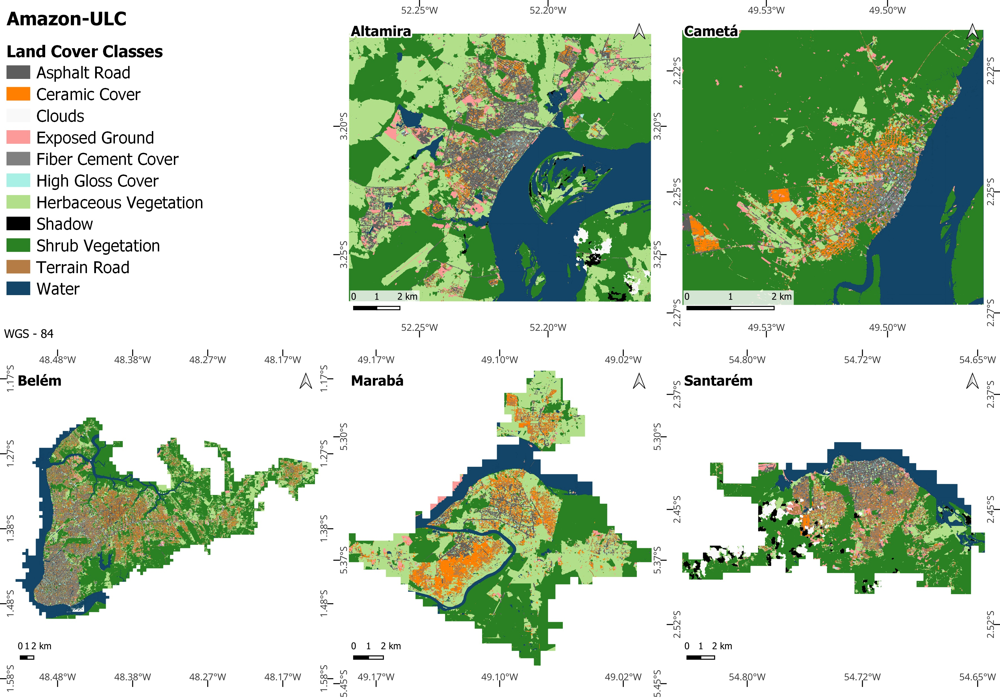

# INTRODUCTION

<<<<<<< HEAD
Remote sensing has been the primary method for collecting data about the Earth's surface in recent years, particularly for developing countries [@Zhu2022].
Numerous opportunities exist to map and monitor cities using remote sensing data which provide accurate quantitative data over time and space, and operate as the basis for physical, climatic, and socioeconomic indicators, sometimes as a complement or even as an alternative to conventional surveys such as the census.
In addition, these data can assist in urban planning once they are converted into information and are consistently prepared and updated [@Weng2018].

Land use and land cover mapping are the most significant applications of remote sensing in urban studies in Brazilian cities [@Almeida2010].
Despite this, most methods that use geoprocessing and remote sensing tools to investigate Brazilian cities have concentrated on Southeastern Brazil [@Santos2022].
Although research about urban areas in the Amazonian region is not completely absent, public managers still need to include such studies in public policies.
This is somewhat complicated by the lack of databases and cartographic publications specific to Amazonian cities [@Cardoso2020].

The Amazon region presents some unique characteristics.
They include the historical process of human occupation in a rain forest region, with distinctive climatic and environmental characteristics.
This is paired with relatively low levels of socioeconomic development, a strong cultural influence from indigenous peoples, sometimes complicated by land and environmental conflict.
In addition, the growth of small and medium-sized cities is a characteristic of the urbanization process in the Amazon, following the reorganization of the national urban network and a new territorial division of labour [@Trindade1998; @Trindade2011].

In this context, the objective of this data paper is to present an Open Data Product (ODP) useful to support research and policy analysis in the cities of Altamira, Cametá, Marabá, Santarém and part of the Metropolitan Area of Belém.
ODPs provide analysis-ready data often with a value-added component [see @arribas2021open].
Presently, we obtain remotely sensed data from public sources; the value added comes from the development of an urban land cover classification system for the cities mentioned above.
Using imagery from the CBERS-4A satellite's WPM sensor, we created a classification model that includes the Geographic Object-Based Image Analysis (GEOBIA) method, data mining strategies, and a random forest machine learning algorithm.

This paper is an example of open and reproducible research that uses only open software and data sources for imagery processing analysis.
We obtained all data from publicly available sources and organized in the form of the Amazon-ULC R data package.
In addition to the Open Data Product, all the code necessary to reproduce, modify, and contribute to the analysis is also shared, in line with best practices in spatial data science [@brunsdon2021opening; @DESJARDINS2022103091].
=======
Remote sensing has been the primary method for collecting data about the Earth's surface in recent years, particularly for developing countries [@zhu2022urban]. Numerous opportunities exist to map and monitor cities using remote sensing data which provide accurate quantitative data over time and space, and operate as the basis for physical, climatic, and socioeconomic indicators, sometimes as a complement or even as an alternative to conventional surveys such as the census. In addition, these data can assist in urban planning once they are converted into information and are consistently prepared and updated [@Weng2018].

Land use and land cover mapping are the most significant applications of remote sensing in urban studies in Brazilian cities [@Almeida2010]. Despite this, most methods that use geoprocessing and remote sensing tools to investigate Brazilian cities have concentrated on Southeastern Brazil [@Santos2022]. Although research about urban areas in the Amazonian region is not completely absent, public managers still need to include such studies in public policies.
This is somewhat complicated by the lack of databases and cartographic publications specific to Amazonian cities [@Cardoso2020].

The Amazon region presents some unique characteristics. They include the historical process of human occupation in a rain forest region, with distinctive climatic and environmental characteristics. This is paired with relatively low levels of socioeconomic development, a strong cultural influence from indigenous peoples, sometimes complicated by land and environmental conflict. In addition, the growth of small and medium-sized cities is a characteristic of the urbanization process in the Amazon, following the reorganization of the national urban network and a new territorial division of labour [@Trindade1998; @Trindade2011].

In this context, the objective of this data paper is to present an Open Data Product (ODP) useful to support research and policy analysis in the cities of Altamira, Cametá, Marabá, Santarém and part of the Metropolitan Area of Belém. ODPs provide analysis-ready data often with a value-added component [see @arribas2021open]. Presently, we obtain remotely sensed data from public sources; the value added comes from the development of an urban land cover classification system for the cities mentioned above. Using imagery from the CBERS-4A satellite's WPM sensor, we created a classification model that includes the Geographic Object-Based Image Analysis (GEOBIA) method, data mining strategies, and a random forest machine learning algorithm.

This paper is an example of open and reproducible research that uses only open software and data sources for imagery processing analysis. We obtained all data from publicly available sources and organized in the form of the Amazon-ULC R data package. In addition to the Open Data Product, all the code necessary to reproduce, modify, and contribute to the analysis is also shared, in line with best practices in spatial data science [@brunsdon2021opening; @DESJARDINS2022103091].
>>>>>>> f93ded9cbef48d852ced52f22b55ff5fbe2c86e8

# MATERIALS AND METHODS

We summarise our methodology in five main steps, as follows.

<<<<<<< HEAD
The definition of the study area is the first step.
The WPM image preprocessing comes second, followed by the segmentation, extraction, and selection features.
The classification of the segments is the final process.
These steps are described in more detail below.
=======
We summarise our methodology in five main steps, as follows. 

The definition of the study area is the first step. The WPM image preprocessing comes second, followed by the segmentation, extraction, and selection features. The classification of the segments is the final process. These steps are described in more detail below.
>>>>>>> f93ded9cbef48d852ced52f22b55ff5fbe2c86e8

For this work, we used the following data:

-   WPM images from the CBERS-4A satellite: orthorectified images, panchromatic and multispectral, from the year of 2020. The WPM sensor provides panchromatic and multispectral images simultaneously. The panchromatic images have 2 meters of spatial resolution, with a spectral range between 0.45 and 0.90 $\mu$ m. Multispectral images have a spatial resolution of 8 meters, with spectral bands: blue (blue, 0.45 - 0.52 $\mu$ m), green (green, 0.52 - 0.59 $\mu$ m), red (red, 0.63 - 0.69 $\mu$ m), NIR (near infrared, 0.77 - 0.89 $\mu$ m). The radiometric resolution of the images is 10 bits. The imaged swath width is 92 km and the revisit period is 31 days [@INPE2019];

The following software applications supported this research:

-   QGIS 3.18 [@QGISTeam2021]: for the thematic maps, image segmentation.

-   TerraView 5.6.3: for preprocessing the satellite images, with the GeoDMA 2.0.1 add-on [@Korting2013] for extracting attributes.

-   Python [@vanRossum1995] and R Languages [@R2022] : preparing and mining the data and classifying the geographic objects with the Random Forest algorithm.

## Study areas

<<<<<<< HEAD
Together, the study areas comprise about 1200 $km^2$ located above the municipal centers of Altamira (153 $km^2$), Cametá (44 $km^2$), Marabá (164 $km^2$), Santarém (143 $km^2$) and part of the Metropolitan Area of Belém (614 $km^2$), as study areas (Figure \ref{fig:study-area}).
All cities are located in the state of Pará, within the Brazilian Legal Amazon.
The study site also covers areas classified as rural in the surroundings of the cities.
For Altamira and Cametá, we used the delimitation of dos Santos et al. [-@Santos2022].
For the other three study areas, we made the delimitation according to the methodology of Gonçalvez et al. [-@Goncalves2021] - which uses night light images to identify potentially populated areas.
According to the *Fundação Amazônia de Amparo a Estudos e Pesquisas*, it is estimated that the municipalities mentioned above have more than 3.5 million inhabitants, representing more than 38\% of the population of the State of Pará.

```{r fig-1, echo=FALSE, out.width=".8\\linewidth", fig.cap="\\label{fig:study-area}Location of the study areas."}
=======
Together, the study areas comprise about 1200 $km^2$ located above the municipal centers of Altamira (153 $km^2$), Cametá (44 $km^2$), Marabá (164 $km^2$), Santarém (143 $km^2$) and part of the Metropolitan Area of Belém (614 km²), as study areas (Figure \ref{fig:study-area}). All cities are located in the state of Pará, within the Brazilian Legal Amazon. The study site also covers areas classified as rural in the surroundings of the cities. For Altamira and Cametá, we used the delimitation of dos Santos et al. [-@Santos2022]. For the other three study areas, we made the delimitation according to the methodology [@Goncalves2021] - which uses night light images to identify potentially populated areas. According to the *Fundação Amazônia de Amparo a Estudos e Pesquisas*, it is estimated that the municipalities mentioned above have more than 3.5 million inhabitants, representing more than 38\% of the population of the State of Pará.

```{r fig-1, echo=FALSE, out.width=".8\\linewidth", fig.cap="\\label{fig:study-area}Location of the study areas."}

knitr::include_graphics("images/location_map.png")
```
>>>>>>> f93ded9cbef48d852ced52f22b55ff5fbe2c86e8

knitr::include_graphics("images/location_map.png")
```

## Pre-processing image

We started the pre-processing stage by cutting the images with the study area polygons. Then, we fused the images with the Principal Components Analysis (PCA) technique. Afterward, we calculated the following indices:

-   Normalized Difference Vegetation Index (NDVI): division of the near-infrared (NIR) band by the red band, normalized, to analyze the presence and condition of vegetation (Equation 1): $$ 
    NDVI = \frac{NIR - RED}{NIR + RED}.
    $$
-   Normalized Difference Roof Index (NDRI): division of the red band by the blue band, normalized, to identify the presence of ceramic roofs and areas with exposed soil (Equation 2): $$ 
    NDRI = \frac{RED - BLUE}{RED + BLUE}.
    $$
-   Bare Soil Area Index (BAI): the normalized division of the blue band by the near-infrared band, to identify exposed soil (Equation 3): $$ 
    BAI = \frac{BLUE - NIR}{BLUE + NIR}.
    $$
-   Normalized Difference Water Index (NDWI): the normalized division of the green band by the near-infrared band (Equation 4). This formula highlights the amount of water in water bodies: $$ 
    NDWI = \frac{GREEN - NIR}{GREEN + NIR}.
    $$

<<<<<<< HEAD
We obtained texture metrics from the Gray Level Co-occurrence Matrix -- (GLCM) [@Haralick1973].
We computed all the GLCM metrics using 3 x 3 pixels as the window size.
We also added fraction images produced by a linear spectral mixture model (LSME).
The LSME technique assumes that given the spectral response of pure targets, it is possible to extract highlighted features of the desired targets in a synthetic image format - which would facilitate the identification of such targets.
The LSME uses a linear relationship to symbolize the spectral mixture of each pixel target, and the spectral response is defined as a combination of each component of the mixture, obeying a proportion between the components whose summation equals [@Shimabukuro2019].
=======
We obtained texture metrics from the Gray Level Co-occurrence Matrix -- (GLCM) [@Haralick1973]. We computed all the GLCM metrics using 3 x 3 pixels as the window size. We also added fraction images produced by a linear spectral mixture model (LSME). The LSME technique assumes that given the spectral response of pure targets, it is possible to extract highlighted features of the desired targets in a synthetic image format - which would facilitate the identification of such targets. The LSME uses a linear relationship to symbolize the spectral mixture of each pixel target, and the spectral response is defined as a combination of each component of the mixture, obeying a proportion between the components whose summation equals [@Shimabukuro2019].
>>>>>>> f93ded9cbef48d852ced52f22b55ff5fbe2c86e8

In this study, we chose the pure pixels that served as the input to the LSME model directly from the WPM multispectral images (with an 8-meter spatial resolution), adopting the classes of vegetation, soil, and water.

## Image segmentation and feature extraction

The fused WPM image was segmented using the Mean-shift algorithm. Mean-shift is a region-based segmentation algorithm that uses local homogenization, where each pixel is replaced by the average of pixels in a search window whose value is within a predefined distance interval [@Comaniciu1997]. Dos Santos performed LULC maps for Altamira, Cametá and Marabá based on WPM imagery. The authors used the mean-shift algorithm implemented in the Orfeo Toolbox (OTB) [@Grizonnet2017].
The values for the spatial radius, range radius, maximum number of interactions, and minimum region size determine the size and shape of the segments. Therefore, we adopt the following values: spatial radius of 5 pixels, range radius of 100 pixels, maximum number of interactions 100 times, and minimum region size of 15 pixels.

We defined classes of objects by size and shape aiming to identify the land cover classes: "Shrub Vegetation" (SV), "Herbaceous Vegetation" (HV), "Water" (Wa), "Exposed Ground" (EG), "High Gloss Cover" (HG), "Ceramic Cover" (Ce), "Fiber Cement Cover" (FC), "Asphalt Road" (As), "Terrain Road" (Te), "Cloud" (Cl) and "Shadow" (Sh).

After segmenting the WPM images, we extracted features for the geographic objects. We extracted spatial features and the mean, maximum, minimum, standard deviation, and range values of the biophysical index layers, GLCMs, multispectral, and fraction images.

## Feature extraction

<<<<<<< HEAD
We employed a stratified random sampling following the prevalent land cover classes.
We set 70\% of samples for training and the remaining 30\% for validation.
After sampling, the variables underwent a pre-classification treatment process, where potential `null` values were filled in.
We next ordered the variables based on their ability to distinguish between different interest classes.
We used the $R^2$ from the Analysis of Variance (ANOVA) for the ordering.
Due to their poor ability to discriminate between classes, we eliminated the attributes with $R^2$ lower than 0.1.

## Classification Model

We developed a supervised classification model using the training base with the random forest (RF) algorithm for each city.
We used the Randomized Search technique to define the RF model's hyperparameters.
In this technique, we input the algorithm values of hyperparameters that will be randomly selected and combined, returning a combination that results in the best possible classification.
The method selects the optimal set of hyperparameters using a performance metric and a fixed number of iterations.
Randomized Search uses cross-validation, dividing the training base into $k$ parts (folds), and the model is trained and evaluated $k$ times.
The algorithm chooses a component (fold) for each iteration to use as an evaluation before training the model on the other $k-1$ parts.
=======
We employed a stratified random sampling following the prevalent land cover classes. We set 70\% of samples for training and the remaining 30\% for validation. After sampling, the variables underwent a pre-classification treatment process, where potential `null` values were filled in. We next ordered the variables based on their ability to distinguish between different interest classes. We used the $R^2$ from the Analysis of Variance (ANOVA) for the ordering. Due to their poor ability to discriminate between classes, we eliminated the attributes with $R^2$ lower than 0.1.

## 2.5. Classification Model

We developed a supervised classification model using the training base with the random forest (RF) algorithm for each city. We used the Randomized Search technique to define the RF model's hyperparameters. In this technique, we input the algorithm values of hyperparameters that will be randomly selected and combined, returning a combination that results in the best possible classification. The method selects the optimal set of hyperparameters using a performance metric and a fixed number of iterations. Randomized Search uses cross-validation, dividing the training base into $k$ parts (folds), and the model is trained and evaluated $k$ times. The algorithm chooses a component (fold) for each iteration to use as an evaluation before training the model on the other $k-1$ parts.
>>>>>>> f93ded9cbef48d852ced52f22b55ff5fbe2c86e8

We examined the hyperparameter values listed in Table 1 using Randomized Search. We used a 5-fold cross-validation, an F1-Score performance indicator, and a maximum of 100 parameter combinations (iterations). After the Random-search selecting the best hyperparameters for the RF model, we classified the entire database.

| Hyperparameter                                   | Values                                                                                              |
|------------------------|------------------------------------------------|
| Number of trees                                  | [1, 20, 50, 100, 150, 200, 250, 300, 350, 400, 450, 500, 550, 600, 700, 800, 900, 1000, 1500, 2000] |
| Criterion                                        | ['gini','entropy']                                                                                  |
| Maximum depth                                    | [5, 10, 20, None]                                                                                   |
| Minimum number of samples to split an inner node | [2, 5, 10]                                                                                          |
| Minimum number of samples to be in a leaf node   | [1, 2, 4]                                                                                           |
| Boostrap                                         | ['True', 'False']                                                                                   |

: Hyperparameters tested in the RF model.

# RESULTS

We developed a land cover classification model for each city. The database contains the set of model hyperparameters that produced the best classification. The metrics F1-Score Macro (average of the F1-Score of the different classes), F1-Score Weighted (average of the F1-Score of the different classes weighted by the number of samples), and Global Accuracy of the classification produced by the RF model over the validation samples are presented in Table 2 for each study area.

| Study area              | **F1-Score Macro** | **F1-Score Weighted** | **Global Accuracy** |
|--------------------|------------------|------------------|------------------|
| Altamira                | 0.90               | 0.90                  | 0.90                |
| Belém Metropolitan Area | 0.75               | 0.95                  | 0.95                |
| Cametá                  | 0.85               | 0.85                  | 0.85                |
| Marabá                  | 0.90               | 0.95                  | 0.95                |
| Santarém                | 0.92               | 0.99                  | 0.99                |

: Metrics for evaluating the land cover classifications for each study area.

<<<<<<< HEAD
According to statistics, the developed models obtained Macro F1-Scores above 75\%, Weighted F1-Scores and Global Accuracy above 85\%.
These high rates show that the RF model's classification successfully classified most of the validation samples, demonstrating a good capacity for classifying data not used in the model's development.
Visually, it is noticeable that the result is satisfactory and in line with the evaluation metrics (Figure \ref{fig:fig-land-cover-classes}).
=======
According to statistics, the developed models obtained Macro F1-Scores above 75\%, Weighted F1-Scores and Global Accuracy above 85\%. These high rates show that the RF model's classification successfully classified most of the validation samples, demonstrating a good capacity for classifying data not used in the model's development. Visually, it is noticeable that the result is satisfactory and in line with the evaluation metrics (Figure \ref{fig:fig-land-cover-classes}).
>>>>>>> f93ded9cbef48d852ced52f22b55ff5fbe2c86e8

```{r fig-2, echo=FALSE, out.width=".8\\linewidth", fig.cap="\\label{fig:fig-land-cover-classes}Urban land cover classification maps of Altamira, Cametá, Belém Metropolitan Area, Marabá and Santarém."}


```

When evaluated using statistical assessment metrics, Santarém had the best classification.
We can explain the better performance of the classification model for Santarém because this study site had a more significant number of samples collected, facilitating the identification of the coverage classes by the algorithm.

In general, the Vegetation classes (Shrub and Herbaceous) and the Water class presented the highest F1-Score.
It might be explained by the spectral nature of these classes, which are easily distinguished.
On the other hand, the Fiber cement and Ceramic classes had the worst F1-Score - both present spectral characteristics similar to the Asphalt Road and Earth Road classes, respectively, which would justify the higher confusion on the part of the classifier algorithm.

<<<<<<< HEAD
# STUDY LIMITATIONS
=======
# 4. STUDY LIMITATIONS
>>>>>>> f93ded9cbef48d852ced52f22b55ff5fbe2c86e8

This work seeks to provide land cover bases for five locations in the Brazilian Legal Amazon. However, although it has met its objective, some limitations must be pointed out.

<<<<<<< HEAD
The methodology we adopted for the satellite image classification was the GEOBIA approach.
This technique requires a segmentation process over the image, grouping the pixels of similar spectral performance.
However, we noticed that some targets were not completely separated during the segmentation process, compromising the classification result by the classifier algorithm.
This segmentation error was more noticeable in the city of Marabá.
Consequently, "not pure" segments were identified, i.e., segments that could be divided into two or more classes.
It is essential to mention that this limitation is due to the our decision to use only algorithms available in open-access software.

Another point to be raised is that even if the classification accuracy levels are considered satisfactory by the research team, it is still possible to find segments misclassified by the Random Forest algorithm.

# CONCLUSION

This work aimed to provide land cover classification maps for Brazilian Amazonian cities.
Land cover maps can contribute to urban planning in Amazonian cities, with applications for monitoring urban sprawl, building in environmental protection areas, assisting in urban zoning, and identifying areas of high building density, among others.
Our classification model used images from the WPM sensor of the CBERS-4A satellite and combined the GEOBIA approach, data mining techniques and the Random Forest machine learning algorithm.
The results obtained are promising regarding the ability to discriminate intra-urban cover classes, achieving an overall accuracy level above 85\% in the validation samples for all study areas.
The integration between the GEOBIA approach and a machine learning algorithm was the reason for this success.
In addition, this work also emphasizes the application of the CBERS-4A satellite, recently launched by the Brazilian government in partnership with the Chinese government, for Amazon urban studies.
=======
The methodology we adopted for the satellite image classification was the GEOBIA approach. This technique requires a segmentation process over the image, grouping the pixels of similar spectral performance. However, we noticed that some targets were not completely separated during the segmentation process, compromising the classification result by the classifier algorithm. This segmentation error was more noticeable in the city of Marabá. Consequently, "not pure" segments were identified, i.e., segments that could be divided into two or more classes. It is essential to mention that this limitation is due to the our decision to use only algorithms available in open-access software.

Another point to be raised is that even if the classification accuracy levels are considered satisfactory by the research team, it is still possible to find segments misclassified by the Random Forest algorithm.

# 5. CONCLUSION

This work aimed to provide land cover classification maps for Brazilian Amazonian cities.
Land cover maps can contribute to urban planning in Amazonian cities, with applications for monitoring urban sprawl, building in environmental protection areas, assisting in urban zoning, and identifying areas of high building density, among others. Our classification model used images from the WPM sensor of the CBERS-4A satellite and combined the GEOBIA approach, data mining techniques and the Random Forest machine learning algorithm. The results obtained are promising regarding the ability to discriminate intra-urban cover classes, achieving an overall accuracy level above 85\% in the validation samples for all study areas. The integration between the GEOBIA approach and a machine learning algorithm was the reason for this success. In addition, this work also emphasizes the application of the CBERS-4A satellite, recently launched by the Brazilian government in partnership with the Chinese government, for Amazon urban studies.
>>>>>>> f93ded9cbef48d852ced52f22b55ff5fbe2c86e8

# Acknowledgments

This research was funded by *"Conselho Nacional de Desenvolvimento Científico e Tecnológico"* (CNPq), grant number 131352/2021-0.
This study was financed in part by the *"Coordenação de Aperfeiçoamento de Pessoal de Nível Superior--Brasil"* (CAPES) -- Finance Code 001 and with the support of Global Affairs Canada, through the Emerging Leaders in the Americas Program (ELAP).
